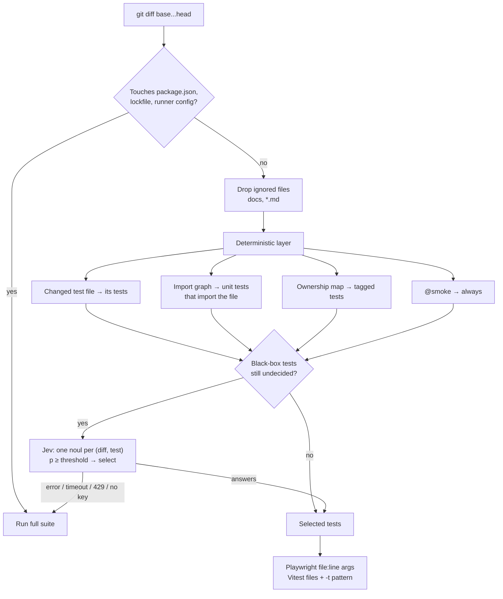

# jev-test-impact

**Run only the tests your change touched, without betting your release on a guess.**

[](https://github.com/criguex/jev-test-impact/actions/workflows/ci.yml)

Most pull requests touch a few files, yet CI runs every test. `jev-test-impact` reads the diff and picks the tests that can be affected. It does that in two layers:

1. **Deterministic rules first.** The import graph, an ownership map and tags decide everything that code can decide exactly.
2. **[Jev](https://docs.typesafe.ai) only for the ambiguous rest.** End-to-end tests don't import the code they exercise, so no graph can connect `src/views/layout.ts` to "adding a book updates the header counter". For those pairs Jev answers one typed yes/no question, *"could this change alter this test's result?"*, and returns a calibrated probability rather than prose.

If Jev is slow, down, rate-limited or returns something odd, **every test runs**. Uncertainty never causes a test to be skipped.

> Spanish summary for non-technical readers: [Explicado simple](#explicado-simple-es).

## Measured results

The benchmark replays the real git history of a small demo shop ([`demo/`](demo), 46 Vitest unit tests + 18 Playwright end-to-end tests) through **20 commits**. Six of them carry realistic regressions, and together they break 15 tests. For every commit the full suite was run once to record which tests really broke. Each policy then picked its tests from the diff alone.

| Policy | Tests run | Skipped | Test time (sum of per-test durations) | Measured wall-clock | Newly failing tests missed | Regressing commits caught |
| --- | --- | --- | --- | --- | --- | --- |
| Full suite | 1311 | 0% | 206.1 s | 143.4 s | 0 of 15 | 6 of 6 |
| Deterministic only, unmapped e2e skipped (unsafe) | 301 | 77.0% | 59.7 s | 70.5 s | **4 of 15** | 5 of 6 |
| Deterministic only, unmapped e2e all run | 527 | 59.8% | 193.8 s | 95.5 s | 0 of 15 | 6 of 6 |
| **Deterministic + Jev (this project)** | **395** | **69.9%** | **122.5 s** | **83.4 s** | **0 of 15** | **6 of 6** |

- Jev cost for the whole replay: 18 calls, 231 questions, 68,852 input tokens, **about $0.003**.
- Wall-clock was measured on an Apple Silicon laptop by actually running each selection. It includes runner and browser start-up, which is why it shrinks less than test time does.
- Four of the 15 broken tests could only be caught by Jev. It rated them 0.93, 0.95, 0.92 and 0.71 against a selection threshold of 0.2. The "unsafe" row shows what happens without that layer: a quick selection that ships a broken cart badge and a broken checkout.
- Full per-commit detail: [`bench/RESULTS.md`](bench/RESULTS.md). Raw data: [`bench/results.json`](bench/results.json) and [`bench/ground-truth.json`](bench/ground-truth.json).

These numbers come from one small demo app with 6 seeded regressions. They show the method works and is safe on that history. They do not predict the savings on your codebase, and the [Service](#service) section explains how to measure that.

## How it works



**Safety policy, enforced in code ([`src/select.ts`](src/select.ts)):**

- A test runs if any deterministic rule selects it **or** Jev's probability is at or above `jev.threshold` (default `0.2`, deliberately low).
- `@smoke` tests always run.
- Changes to `fullSuiteOn` files (package manifests, lockfiles, runner configs, the impact config) run everything.
- A change with no readable diff (binary files) selects every black-box test.
- Any Jev failure (network, HTTP error, malformed answer, missing answer) runs the full suite, and the error body is logged.
- The full suite still runs on `main` and nightly ([`ci.yml`](.github/workflows/ci.yml)), so a gap in the selector can only delay detection by a few hours. It can never hide a bug permanently.

**What Jev is asked.** The `state` is the diff of one file: its path, status and hunks with the removed and added lines. Each question is a `noul` whose `instructions` object holds the test's file, its title path and its steps. The steps are the test body plus any local helper functions it calls. Questions are batched up to 40 per call. See [`src/jev/judge.ts`](src/jev/judge.ts). The question text and criteria live in one place so they are easy to review.

## Quick start

Requires Node 22+ and git.

```bash
git clone https://github.com/criguex/jev-test-impact && cd jev-test-impact
npm ci
npm test                          # tool unit tests
JTI_JEV_MODE=replay npm run bench # replay benchmark offline, from recorded Jev answers
```

Use it on a project that has an `impact.config.json` (see [`demo/impact.config.json`](demo/impact.config.json)):

```bash
# Explain the selection
npx github:criguex/jev-test-impact select --base origin/main

# Run only the affected tests of one suite (skips it if nothing is affected, runs all on fail-safe)
npx github:criguex/jev-test-impact run --suite e2e  --base origin/main -- npx playwright test
npx github:criguex/jev-test-impact run --suite unit --base origin/main -- npx vitest run

# In GitHub Actions: writes step outputs (unit=all|some|skip, unit_args=...) and a job summary table
npx github:criguex/jev-test-impact select --base origin/${{ github.base_ref }} --format github
```

A ready-to-copy workflow is in [`examples/github-action.yml`](examples/github-action.yml). This repository uses the same flow on its own demo in [`.github/workflows/impact.yml`](.github/workflows/impact.yml).

**Jev access.** Set `TYPESAFE_API_KEY` (direct) or `AI_GATEWAY_API_KEY` (Vercel AI Gateway, `POST https://ai-gateway.vercel.sh/typesafe/v1/systemone`). Both answer shapes are normalized: the native `noul` and the gateway's `boolean`/`probability`.

| `JTI_JEV_MODE` | Behavior |
| --- | --- |
| `auto` (default) | Use a recorded answer if one exists, otherwise call Jev live and record it |
| `replay` | Recorded answers only. A missing one means Jev can't answer, so the full suite runs |
| `record` | Always call live and overwrite recordings |
| `live` | Always call live, never record |

Recordings are keyed by a hash of the exact request, so a changed diff or question can never reuse a stale answer.

## Configuration

```jsonc
{
  "suites": [
    { "name": "unit", "runner": "vitest", "include": ["tests/unit/**/*.test.ts"], "strategy": "import-graph" },
    { "name": "e2e", "runner": "playwright", "include": ["tests/e2e/**/*.spec.ts"], "strategy": "black-box" }
  ],
  "alwaysRun": ["@smoke"],
  "fullSuiteOn": ["package.json", "package-lock.json", "playwright.config.ts", "vitest.config.ts", "impact.config.json"],
  "ignore": ["**/*.md", "docs/**"],
  "owners": [{ "files": ["src/auth.ts", "src/views/login.ts"], "tags": ["@auth"] }],
  "jev": { "threshold": 0.2, "maxQuestionsPerCall": 40 }
}
```

- `import-graph` suites trust the static import graph: if a unit test doesn't import the changed file, directly or transitively, it is not affected.
- `black-box` suites (end-to-end, API, contract) never trust that "no". Tests the rules don't select go to Jev.
- `owners` is optional and can stay incomplete. The demo map deliberately misses layout, server and cart files, and Jev covered those gaps in the benchmark.

## Reproduce the benchmark

```bash
npm run bench:truth          # rebuild demo history from bench/history/*.patch and run the full suite per commit (~3 min)
npm run bench -- --execute   # select per commit with every policy and time the selected runs
npm run bench -- --check     # CI: offline replay must match bench/results.json and miss nothing
```

The demo history is stored as `git format-patch` files and rebuilt with fixed dates, so the commit SHAs come out the same on every machine.

## How this differs from `jev-test-filter`

[mizchi/jev-test-filter](https://github.com/mizchi/jev-test-filter) is a solid, multi-runner tool that asks Jev to score every test against the diff. This project makes a narrower bet aimed at teams that can't afford a missed regression:

- Jev is the **second** layer. Import graph, owners and tags decide first, and Jev only sees black-box tests that code cannot rule on. In the benchmark that meant 231 questions, where one question per test per commit would have been 1,311.
- **Fail-safe by construction.** Any uncertainty about Jev itself becomes a full run.
- **A replay benchmark with ground truth.** It publishes the missed-failure rate next to the savings and compares against unsafe and safe baselines without Jev.

## Limits

- The import graph follows static relative imports, `import()` with literal paths, and JSON imports. It does not see files read at runtime through `fs`, path aliases, or code generation. Put such files in `fullSuiteOn` or give them an owner rule.
- The sample is small: 20 commits and 15 broken tests on one app. A 0-miss result there is evidence, not a guarantee. The nightly and `main` full runs are the backstop.
- In the catalog regression the two failing end-to-end tests were caught by the `@smoke` rule, not by Jev. Smoke tests are selected before Jev is asked, so it never rated them, and the benchmark can't say whether it would have caught them. A good smoke set matters.
- Refactors of shared code (for example `src/server.ts`) push many Jev probabilities just above the threshold. That's safe, but it saves less.
- Runners supported today: Vitest and Playwright. The selection core is runner-agnostic, and adding one means writing a new `runnerArgs` branch.
- Jev latency is not included in the wall-clock numbers, because the timed replay used recorded answers, and live latency was not measured. While recording, the gateway sometimes returned 429 "high demand". Those calls were retried with backoff. When retries ran out, the fail-safe ran the full suite, which is correct but saves nothing.

## Explicado simple (ES)

**El problema.** Cada vez que alguien cambia una línea de código, el sistema de integración continua corre *todas* las pruebas del producto. Es como mandar a revisar todo el carro, llantas, frenos, luces y motor, porque se cambió el espejo retrovisor. Es seguro, pero lento y caro, y el equipo espera.

**La idea.** Revisar solo lo que el cambio pudo haber tocado, sin arriesgarse a dejar pasar un daño.

**Cómo decide, en dos pasos:**

1. **Primero, lo que se puede saber con certeza.** El código sabe qué pruebas usan qué archivos, como un plano del carro. Si cambió el espejo, sabemos exactamente qué piezas lo tocan. Eso no necesita IA.
2. **Después, solo para lo dudoso, se le pregunta a Jev.** Algunas pruebas miran el producto "desde afuera", como un cliente que maneja el carro, y el plano no dice si el cambio las afecta. Para esas le preguntamos a Jev, una IA que no escribe textos: responde sí o no con un porcentaje de confianza ("85% de que sí puede afectar"). Si hay una duda razonable, desde un 20%, la prueba se corre.

**La regla de oro.** Si Jev falla, tarda o no está disponible, se corren todas las pruebas. Ante la duda, nunca se salta nada. Además, todas las noches y en cada entrega final se corre la batería completa como red de seguridad.

**¿Funciona?** Lo medimos reproduciendo 20 cambios reales de una tienda de ejemplo en la que sembramos 6 errores a propósito:

- Se corrieron **70% menos pruebas** y el tiempo medido bajó de 143 s a 83 s (**42% menos**).
- Se detectaron **todas** las pruebas que se rompieron (15 de 15) y los 6 cambios con error.
- Sin la ayuda de Jev, la versión "rápida" dejaba escapar 4 de las 15 fallas. La versión "segura" sin Jev ahorraba mucho menos tiempo.
- Todas las consultas a Jev del experimento costaron menos de un centavo de dólar.

Es una prueba en una aplicación pequeña. En su proyecto el ahorro real se mide con su propio historial, que es justamente lo que ofrece el servicio.

## Service

I set this up on your repository and measure it on your own history before you rely on it.

1. **Setup.** I write `impact.config.json` for your suites, add the GitHub Actions workflow, and keep the full suite on `main` and nightly.
2. **Replay on your history.** I replay your last N merged pull requests. For each one I compare the selected tests against the tests that really failed in CI, and I report skipped %, CI minutes saved and missed failures, with the same method and tables as above.
3. **Tuning.** Owner rules, smoke set and Jev threshold, adjusted until the replay shows zero missed failures, and I report the savings that remain at that setting.
4. **Handover.** You get the config, the workflow, recorded Jev answers for offline CI, and a short runbook for changing the threshold or adding suites.

Supported today: TypeScript projects that use Vitest and/or Playwright on GitHub Actions. The only measured savings so far are the benchmark above, and there are no client case studies yet. Contact: [github.com/criguex](https://github.com/criguex).

## License

MIT © Cristian Guerra
